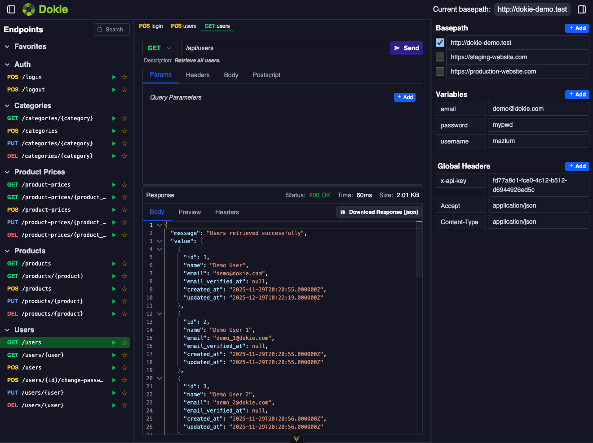

# Dokie

Laravel:

ASP.NET Core:

An API client and documentation UI, inspired by [Postman](https://www.postman.com/).
A replacement for libraries like [Swagger UI](https://swagger.io/tools/swagger-ui) and [Scalar](https://scalar.com/).

See the demo at: [https://dokie.mergesoft.dev/dokie](https://dokie.mergesoft.dev/dokie).

Currently, it only has packages for ASP.NET Core and Laravel, but it is planned to be extended to other platforms in the future. If you are interested in a specific platform, please open an issue or pull request.

## Installation

- for ASP.NET Core applications visit: [packages/aspnetcore/README.md](./packages/aspnetcore/README.md)
- for Laravel applications visit: [packages/laravel/README.md](https://github.com/mergehez/dokie-laravel)
- for other platforms, please open an issue or pull request.

## Features

- **OpenAPI Support**: Automatically generates the UI based on OpenAPI specifications.
- **Configurable**: Set predefined variables, headers, and postscripts.
- **Hostname Switching**: Easily switch between different hostnames for testing.
- **Favorites**: Mark endpoints as favorites for quick access.
- **Environment Variables**: Add/remove environment variables to manage sensitive data like API keys.
- **Global headers**: Set global headers for all requests.
- **Postscripts**: Add custom scripts that run after a request is made, allowing you to set environment variables or global headers based on the response. (JavaScript)
- **Endpoint Configuration**: Easily add path/query parameters, headers and body to requests. You can use environment variables just like in Postman.

> Note that changes are stored in your local machine and not shared with other people using the same project. Following information is stored in the browser's indexedDB:
> - Environment variables
> - Global headers
> - Favorite endpoints
> - Current hostname
> - Endpoint specific: Path/Query parameters, Headers and Postscript

## Screenshot

## Contributing

Feel free to contribute to the project by creating issues or pull requests.

## License

This project is licensed under the MIT License - see the [LICENSE](./LICENSE) file for details.
Feel free to use, modify, and distribute this code as per the terms of the license.