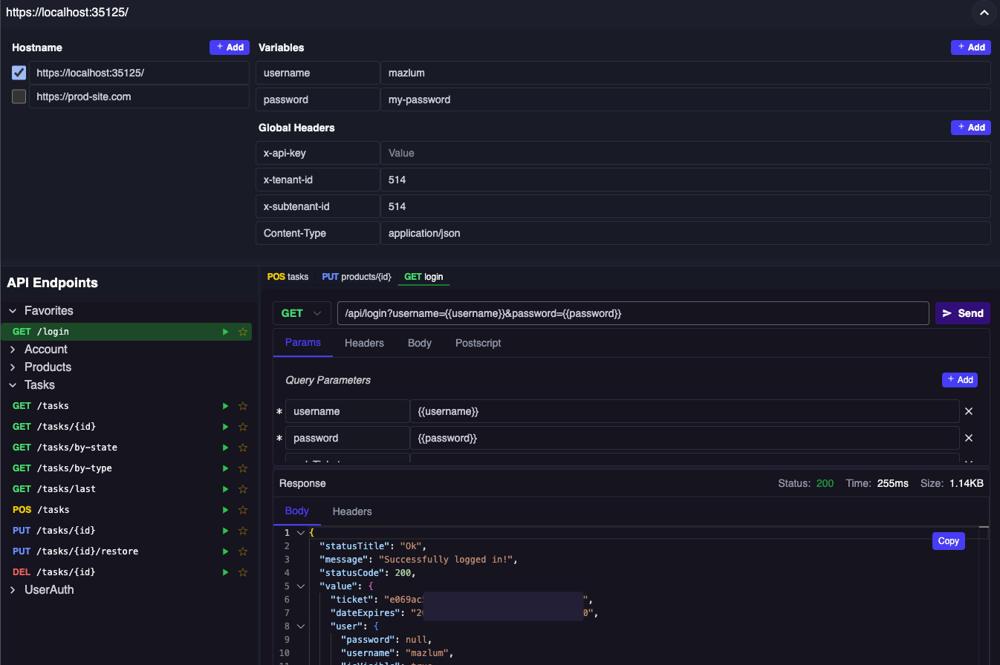

# Dokie

[](https://www.nuget.org/packages/Dokie)
[](https://www.nuget.org/packages/Dokie)
[](https://github.com/mergehez/dokie/blob/main/LICENSE)

An API client and documentation UI, inspired by [Postman](https://www.postman.com/).
A replacement for libraries like [Swagger UI](https://swagger.io/tools/swagger-ui) and [Scalar](https://scalar.com/).

See the demo at: [https://dokie.mergesoft.dev/dokie](https://dokie.mergesoft.dev/dokie).

Currently, it only has a NuGet package for ASP.NET Core applications, but it is planned to be extended to other platforms in the future. If you are interested in a specific platform, please open an issue or pull request.

## Installation

1. Using Package Manager:
    ```
    Install-Package Dokie
    ```
2. Using .NET CLI:
    ```
    dotnet add package Dokie
    ```
3. Using NuGet Package Manager: search for `Dokie`

## Usage

To use Dokie in your ASP.NET Core application, you'll have to use OpenAPI to document your API endpoints. Dokie will automatically generate the UI based on the OpenAPI specification.

After installing the package, you can set it up in your `Program.cs` file as follows:

```csharp
using Microsoft.OpenApi;
using Dokie;

var builder = WebApplication.CreateBuilder(args);

var services = builder.Services;

services.AddOpenApi("v1", options =>
{
    options.OpenApiVersion = OpenApiSpecVersion.OpenApi3_0;
    options.AddDokie();
});

var app = builder.Build();

if (app.Environment.IsDevelopment())
{
    app.UseDokie("v1", new DokieOptions
    {
        Title = "Dokie",
        HostnameOptions = ["https://prod-site.com"],
        PredefinedVariables = new Dictionary<string, string>
        {
            { "username", _secrets.Username },
            { "password", _secrets.Password },
        },
        PredefinedHeaders = new Dictionary<string, string>
        {
            { "x-api-key", "" },
            { "Content-Type", "application/json" },
        },
        Postscripts = new Dictionary<string, string>
        {
            { "GET /api/login", "envs.headers['x-api-key'] = response.data.value.ticket;" },
        },
        PredefinedFavoriteEndpoints =
        [
            "GET /api/login"
        ]
    });
}

app.Run();
```

After setting up the above code, you can access the Dokie UI at `/dokie` in your browser.

## Features

- **OpenAPI Support**: Automatically generates the UI based on OpenAPI specifications.
- **Configurable**: Set predefined variables, headers, and postscripts.
- **Hostname Switching**: Easily switch between different hostnames for testing.
- **Favorites**: Mark endpoints as favorites for quick access.
- **Environment Variables**: Add/remove environment variables to manage sensitive data like API keys.
- **Global headers**: Set global headers for all requests.
- **Postscripts**: Add custom scripts that run after a request is made, allowing you to set environment variables or global headers based on the response. (JavaScript)
- **Endpoint Configuration**: Easily add path/query parameters, headers and body to requests. You can use environment variables just like in Postman.

> Note that changes are stored in your local machine and not shared with other people using the same project. Following information is stored in the browser's indexedDB:
> - Environment variables
> - Global headers
> - Favorite endpoints
> - Current hostname
> - Endpoint specific: Path/Query parameters, Headers and Postscript

## Screenshots




## Contributing

Feel free to contribute to the project by creating issues or pull requests.

## License

This project is licensed under the MIT License - see the [LICENSE](./LICENSE) file for details.
Feel free to use, modify, and distribute this code as per the terms of the license.