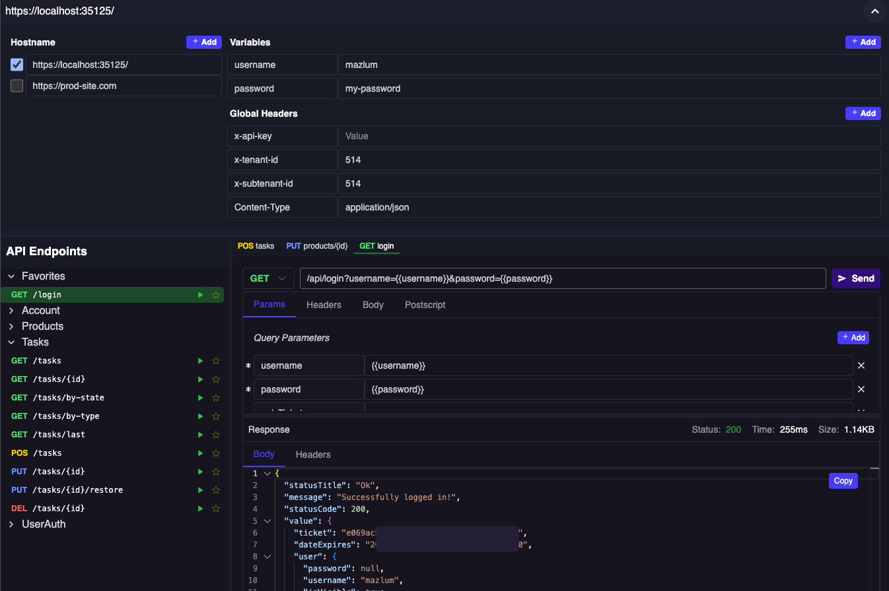
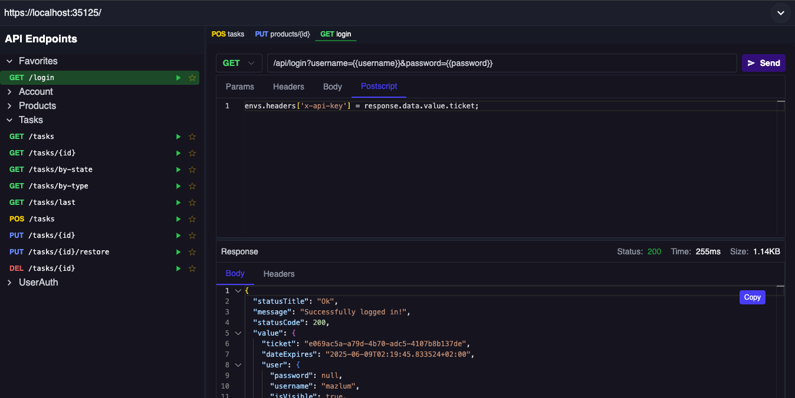

# Dokie

An API documentation UI for ASP.NET Core applications, inspired by [Postman](https://www.postman.com/);

This library is a replacement for libraries like [Swagger UI](https://swagger.io/tools/swagger-ui) and [Scalar](https://scalar.com/).

It is compatible with .NET 7, .NET 8, and .NET 9.

Feel free to contribute to the project by creating issues or pull requests.

## Screenshots

